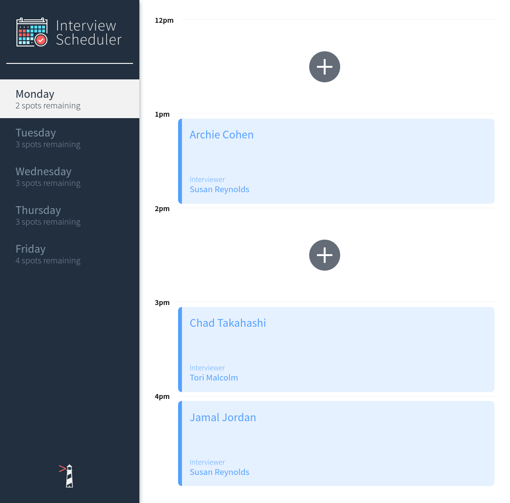
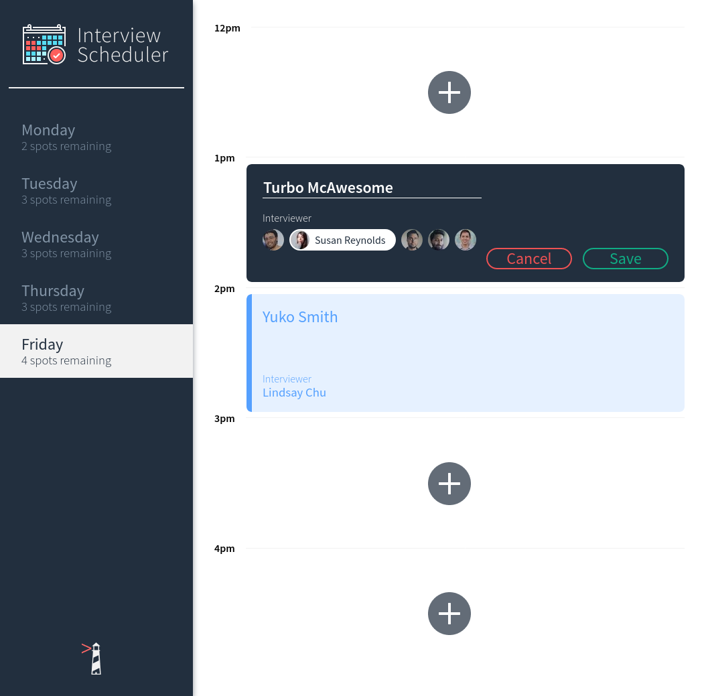
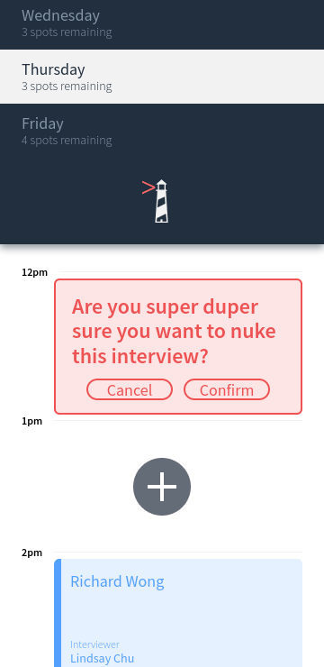

# Interview Scheduler

Interview Scheduler is what its name suggests: a simple interview appointment scheduling tool.  It is a demonstration of responsive, single-page web app design using React that is suitable for use on any device.  It does not include user account management, but stores schedule information in a database and updates the schedule for concurrent users via WebSockets.

Technologies used include [React](https://reactjs.org/), [SASS](https://sass-lang.com/), [WebPack](https://webpack.js.org/), [Babel](https://babeljs.io/), [Axios](https://www.npmjs.com/package/axios) client-side, [Node.js](https://nodejs.org), [Express](https://expressjs.com), [WebSockets](https://developer.mozilla.org/en-US/docs/Web/API/WebSockets_API), [Postgres](https://postgresql.org) server-side, and [Storybook](https://storybook.js.org/), [Testing Library](https://testing-library.com/), [WebPack Dev Server](https://github.com/webpack/webpack-dev-server), [Jest](https://jestjs.io/), and [Cypress](https://www.cypress.io/) for development and testing.

An online demonstration is available at **https://scheduler.ml**.  The server is deployed on [Heroku](https://heroku.com), while continuous integration is used to automatically deploy the client to production on [Github](https://github.com) via [CircleCI](https://circleci.com), with [Netlify](https://netlify.com) managing hosting.  Note that loading the initial schedule may take several seconds as the app is hosted on a free Heroku account that sleeps after being idle for 30 minutes.  It is otherwise highly responsive once running.

Interview Scheduler is not suitable for real-world production use and is only for demonstration and educational purposes.

## **Screenshots**

Interview Scheduler is pretty slick.

Large screen, initial display:



Editing an appointment:



Cancelling an appointment on a phone:



# Table of Contents

- [Development](#development)
  - [Directory Structure](#directory-structure)
  - [Dependencies](#dependencies)
  - [Development Dependencies](#development-dependencies)
  - [Support Setup](#support-setup)
  - [Database/API Server Setup](#database/api-server-setup)
  - [Client Setup](#client-setup)
  - [Running Webpack Development Server](#running-webpack-development-server)
  - [Running Storybook Visual Testbed](#running-storybook-visual-testbed)
- [Testing](#testing)
  - [Database Setup](#database-setup)
  - [API Server Setup](#api-server-setup)
  - [Client Setup](#client-setup)
  - [Running Jest Test Framework](#running-jest-test-framework)
  - [Running Cypress Test Framework](#running-cypress-test-framework)

## **Development**

### **Directory Structure**

The project directory is arranged as follows:

```
./                 Main project repository
./docs             Project documentation
./public           Static files served to the client, including manifest.json
./public/images    Static images used on the site
./src              Project source code
./src/__mocks__    Axios mocks
./src/components   React components
./src/hooks        React hooks
./src/helpers      Helper functions
./src/reducers     Application reducer function
./src/styles       SASS styles
./cypress          Cypress testing fixtures and tests, etc
./stories          Storybook component stories

Do not edit or push to repo:

./node_modules     Node.js packages
./coverage         Jest code coverage results
```

### **Dependencies**

Interview Scheduler requires [Node.js](https://nodejs.org) and [Postgres](https://www.postgresql.org/) and the following [NPM](https://www.npmjs.com/) packages are used:

- [react](https://www.npmjs.com/package/react)
- [react-dom](https://www.npmjs.com/package/react-dom)
- [react-scripts](https://www.npmjs.com/package/react-scripts)
- [axios](https://www.npmjs.com/package/axios)
- [classnames](https://www.npmjs.com/package/classnames)
- [normalize.css](https://www.npmjs.com/package/normalize.css)

### **Development Dependencies**

The following NPM packages are used for development:

- [react-test-renderer](https://www.npmjs.com/package/react-test-renderer)
- [prop-types](https://www.npmjs.com/package/prop-types)
- [node-sass](https://www.npmjs.com/package/node-sass)
- [cypress](https://www.npmjs.com/package/cypress)
- [eslint-plugin-cypress](https://www.npmjs.com/package/eslint-plugin-cypress)

### **Support Setup**

Install Node.js from your [package manager](https://nodejs.org/en/download/package-manager/), or [download](https://nodejs.org/en/download/) binaries (for fun) or source code (for maximum fun).

Install [Postgres](https://www.postgresql.org).

### **Database/API Server Setup**

Execute the following to set up Interview Scheduler API server:

```sh
cd <project-directory>
git clone https://github.com/d0ugr/scheduler-api
cd scheduler-api
npm install
```

Log into Postgres as a user with superuser privileges.  For example:

```sh
sudo -u postgres psql
```

Execute the following to set up the development database and populate it with data:

```postgres
CREATE USER scheduler_development WITH NOSUPERUSER PASSWORD 'development';
CREATE DATABASE scheduler_devlopment OWNER scheduler_development;
GRANT ALL ON DATABASE scheduler_devlopment TO scheduler_development;
\c scheduler_development
\i src/db/schema/create.sql
\i src/db/schema/development.sql
-- Use this to verify the data:
SELECT * FROM days JOIN appointments ON appointments.day_id = days.id;
```

Create the file `<project-directory>/scheduler-api/.env.development` with the following:

```
PGHOST=localhost
PGUSER=scheduler_development
PGDATABASE=scheduler_development
PGPASSWORD=development
PGPORT=5432
```

### **Client Setup**

Execute the following to set up Interview Scheduler:

```sh
cd <project-directory>
git clone https://github.com/d0ugr/scheduler
cd scheduler
npm install
```

Create the file `<project-directory>/scheduler/.env.development` with the following:

```
REACT_APP_WEBSOCKET_URL=ws://localhost:8001
PORT=8000
CHOKIDAR_USEPOLLING=false
```

### **Running Webpack Development Server**

```sh
cd <project-directory>/scheduler
npm start
```

### **Running Storybook Visual Testbed**

Storybook is excellent for testing React components in isolation from the rest of the application for development or testing.

```sh
cd <project-directory>/scheduler
npm run storybook
```

## **Testing**

### **Database Setup**

Log into Postgres as a user with superuser privileges.  For example:

```sh
sudo -u postgres psql
```

Execute the following to set up the test database and populate it with data:

```postgres
CREATE USER scheduler_test WITH NOSUPERUSER PASSWORD 'test';
CREATE DATABASE scheduler_test OWNER scheduler_test;
GRANT ALL ON DATABASE scheduler_test TO scheduler_test;
\c scheduler_test
\i src/db/schema/create.sql
\i src/db/schema/test.sql
-- Use this to verify the data:
SELECT * FROM days JOIN appointments ON appointments.day_id = days.id;
```

### **API Server Setup**

Create API server test environment file:

`<project-directory>/scheduler-api/.env.test`

```
PGHOST=localhost
PGUSER=scheduler_test
PGDATABASE=scheduler_test
PGPASSWORD=test
PGPORT=5432
```

Run the API server in test mode:

```sh
cd <project-directory>/scheduler-api
npm run test:server
```

### **Client Setup**

Create client test environment file:

`<project-directory>/scheduler/.env.test`

```
REACT_APP_WEBSOCKET_URL=ws://localhost:8001
PORT=8000
CHOKIDAR_USEPOLLING=false
```

### **Running Jest Test Framework**

```sh
cd <project-directory>/scheduler
npm test
```

### **Running Cypress Test Framework**

Make sure you're running the API server in test mode with the appropriate data.

```sh
cd <project-directory>/scheduler
npm run cypress
```

Click "Run all specs" or select individual specs from the Tests pane in the Cypress window.
